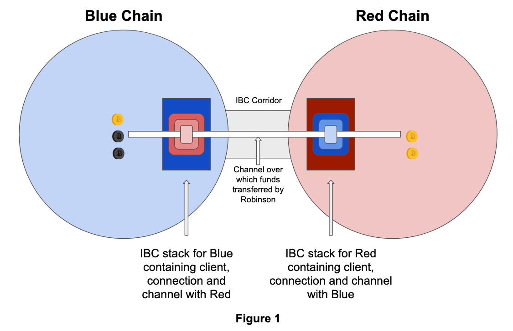
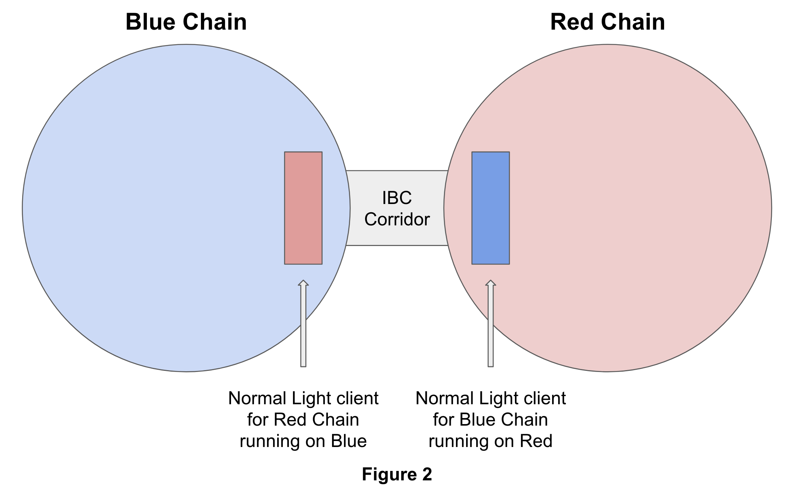
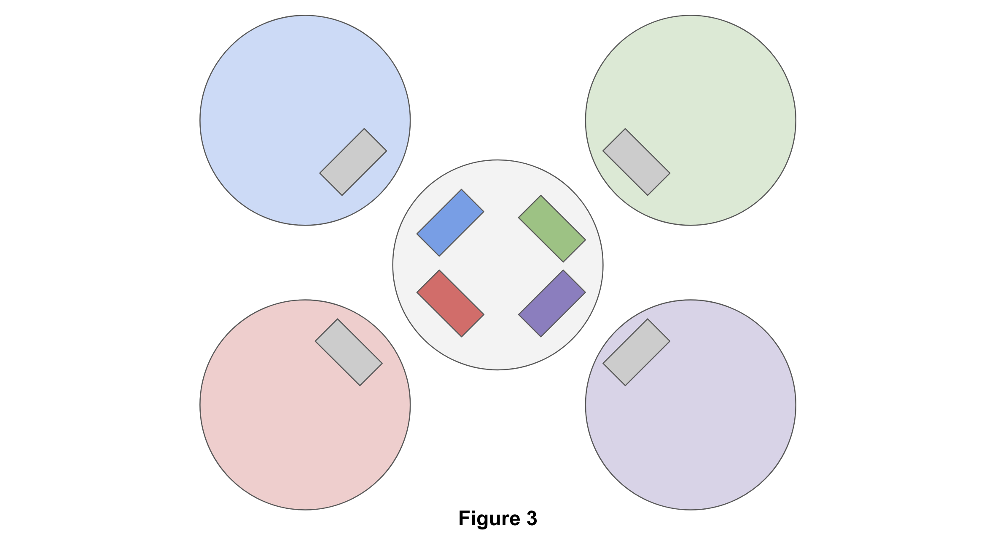

### 1: Introduction 
This file documents the issues around IBC upgrades at an ecosystem level with multiple chains connected. The concerns were raised in the IBC core co-ordination call.

### 2: Principles for upgrades
This section lists several essential ideas, which will combine in later chapters to detail the various issues with ecosystem-level IBC upgrades.

#### 2.1: The key need of end users
Let's consider this situation described in Figure 1.

Conceive Robinson, who transferred funds from blue chain to red chain using a particular channel on top of a connection/client. Robinson relies on the channel retaining its identity and properties throughout any upgrades to red and blue chains. There are different violations, detailed in this document, that could lead to Robinson’s funds being stuck/frozen on red if upgrades don’t take place correctly.

The basic principle is that: *IBC upgrades, at all levels of the stack, require execution in a way that channels are unimpaired*. Users can expect a particular channel to be immortal since they could have transferred funds over the channel and be unavailable to make any further changes to the status quo. The end-user to design IBC for is Robinson Crusoe - they moved funds over a channel someday, and then are offline on a Pacific island for 40 years. When they return online, those funds should be around in the same state, and transferable back over the channel, provided the two chains live.

#### 2.2: End-users will perceive the ecosystem not a pairwise set of chains
The second key idea is that we're collectively building an ecosystem of a hub and multiple zones connected to the Hub. The Hub's value proposition is that it removes the need for all zones to create pairwise connections with each other, thus saving on scarce computational resources for each of them. A user can conceivably have transferred funds from the purple zone to the green zone via the Hub. Their transfer is exposed to 2 channels - one between the purple zone and Hub, and another between Hub and green zone. This orchestration across two channels will probably happen without the user consciously opting into it. An ecosystem of end zones and one Hub will have complicated paths with multiple channels implicated. IBC upgrade paths should exist for all chains such that the entire ecosystem of channels remains functional. In particular, we need to be aware of upgrade patterns that break one channel between two chains, leading to a ripple effect on the entire ecosystem.

#### 2.3: Sequencing upgrades for an IBC corridor
Let's consider this situation described in Figure 1. The Red chain wants to make an upgrade to its consensus process or headers. Post that upgrade, old light clients for Red won't be able to validate the new headers emitted by Red. In other words, it's a breaking change. In this scenario, the light clients must upgrade to follow the new headers before the chain upgrade. If this strict sequencing is not maintained, the old light clients will get stuck at a particular block height and will be unable to make any progress. Any funds that depend on such a stuck light client will also be, correspondingly, stuck. Once stuck, the only way to recover from the situation is to hard fork whichever chains are running the light client through a manual governance process. A messy political battle can ensue between two communities. *Sequencing is vital for upgrades Light clients update first, chains upgrade second for breaking changes.*

#### 2.4: Upgrade constraint in Stargate
This sub-section lists a constraint with Stargate, and potentially the Golang-IBC implementation of IBC. Updation of a light client (for the Red Chain) on the Blue chain requires the entire binary with Tendermint plus Cosmos SDK to be switched by every validator of the Blue chain. A full governance referendum followed by a dump state restart is necessitated. There is no mechanism to upgrade just the red light client without governance selectively. A typical Cosmos chain is unlike the Substrate or Ethereum ecosystems where pieces of code (smart contracts or pallets), can be upgraded independently of a hard fork of the entire base chain. Later sections detail why this may be a significant limitation and conceive how the IBC ecosystem could get such a capability relatively quickly.

#### 2.5: Economic costs of chain upgrades
Each chain governance and upgrade cycle has a cost associated with it. Think of the Hub with 125 validators. Let's assume each person-hour is worth $100 to the Cosmos Hub DAO. Following individual and total costs exists for one upgrade on the Cosmos Hub: 

* Each governance vote probably requires 125+ voters to spend 4 hours each. That's 500 community person-hours. The cost to Hub DAO is $50k per dump start upgrade. 
* 4 hours effort is required by each validator for the upgrade preparation, execution, and troubleshooting those cases in which the upgrade is not smooth. In total, that involves another 500 community person-hours. The cost to Hub DAO is $50k.
* There is some variable cost associated with the Cosmos SDK release and it's testing. Assuming that the average Hub upgrade takes two engineer months in development, that's a cost of $50k.
* Hence, we can estimate the total costs of one governance cycle plus one dump state restart to be $150k.
 
Given each chain upgrade costs $150k, a natural desire exists to reduce the total number of Hub upgrades per year. A similar incentive will exist in all zone in the Cosmos eco-system. Therefore, the IBC upgrade process should be as lean as possible to keep the COGS of these DAOs low, while preserving decentralization.

#### 2.6 Keep Tendermint/IBC nimble
A final consideration is that IBC and Tendermint consensus upgrades should remain open to radical design changes. At the consensus layer, the crypto space is exceptionally competitive - Avalanche, Solana, GRANDPA, and other consensus mechanisms go live in 2020. At the interchain communication layer, competition from ChainBridge and XCMP will heat up. While the Cosmos community has done a splendid job at skating to where the puck is (and will be), we need to keep nimble and prevent these codebases from getting stymied.

### 3: Challenges outlined in the core co-ordination call
Two key challenges have been hitherto highlighted: The difficulty of ecosystem level upgrades to Tendermint that break light clients and packet-timeout problems with chain upgrades with subjectively decided dump-state restarts. The next sub-sections cover these issues. 

#### 3.1: Light client breaking Tendermint upgrades
Let's return to the two Cosmos-SDK plus Tendermint chains that run light clients for each other, and send packets over an IBC connection - red chain and blue chain. Figure 2 is a simplified version of Figure 1. The darker squares represent light clients of the chains running on the counter-party. The latest, and greatest, (light-client) breaking release of Tendermint ships. Red and Blue communities are excited to have the unique feature - BLS signatures, zkProofs, whatever. How does the upgrade cycle work as per the current Go-IBC implementation?

It's complicated - there are four steps for execution in sequence:
1. Blue chain upgrades and the new release only contains the new light client for Red. Blue can't update its consensus yet since it's light client on Red isn't updated yet.
2. The Red chain upgrades its Tendermint consensus algorithm since it now has an updated light client on Blue.
3. The Red chain then updates the blue light client running on Red.
4. Blue chain upgrades its Tendermint consensus algorithm.

Steps 2 and 3 are composable into a single upgrade. The two communities in total need three separate full governance votes. That's $400k+ for a single Tendermint update in COGS across the two communities. Another issue is that the governance burden is asymmetric - blue needs to execute governance votes (and dump state restart) twice, while red runs it only once. The utility from the process is identical, while the responsibility and COGS are asymmetric. A game of chicken is likely - both communities will want the other to do more work due to the value at stake.

The complicated case is plot in Figure 3 - a network of four zones and a Hub. While the diagram considers four zones, the general case is n zones. 

How does the ecosystem upgrade? Like this:
1. Blue, Green, Purple, and Red upgrade the light client for Gray Hub, on their chains, via governance and dump state restart. That's four separate governance upgrades costing $600k to different communities. 
2. Gray Hub upgrades its consensus engine and light clients for Blue, Green, Purple, and Red. A cost of $150k.
3. Blue, Green, Purple, and Red upgrade their Tendermint consensus engines. Another $600k in cost. 

In the four-zone case, the total cost could exceed $1 million. For one Hub and n zones, 2n+1 governance processes (and dump start upgrades) are necessary, and the costs scale up accordingly. Some optimization that reduces the governance burden is useful. The broader considerations go beyond the financials:

* **Topology constraint**: Imagine yourself as Chain Red. When you connect to a Hub, you need to do two upgrades every time the Hub upgrades. As a result, you want to link only to one Hub. Recurse that conservatism across all chains, and a single Hub dominates. A single Hub cannot physically handle connections to hundreds, if not thousands, of zones. It caps the size of the ecosystem. In other words, the indicated upgrade pattern imposes constraints on the evolution of the Internet of Blockchains' topology.

* **Rare Hub upgrades:** If the Hub connects to 50 chains and atoms have migrated to all of these; the Hub will need to coordinate with all 50 to upgrade itself. Several million dollars in costs are imposed on the ecosystem. Therefore, Hub consensus upgrades become sparse. The rate of innovation slows down dramatically as a result.

* **Perverse pattern:** The ecosystem requires the most conservative chain (the Hub) to upgrade to trial any breaking feature in Tendermint. A zone connected to the Hub can't just try the new, experimental, Tendermint on its own accord. 

* **The propensity of Tendermint to fork:** The natural consequence is that different teams fork off at the codebase level and promote their version of Tendermint. The "official" repo that is followed by the Hub is judged too slow.

#### 3.2 Block number continuity breaking upgrades
A different kind of problem arises when one considers the block-based packet-timeout mechanism in IBC. This mechanism essentially allows the Red chain to send a packet to the Blue Chain, with a block number based timeout. If the Blue chain does not process the particular packet by the specific block number, the sender of the packet can submit proof of noninclusion to Red and have Red handle the error gracefully. 

An illustrative example for this feature is the case of a user locking up Bitcoin-representing tokens on the Red chain, and requesting blue to mint Bitcoin vouchers there. If Blue does not mint the coupons by the indicated block, the user can use the timeout mechanism to request Red to release their locked tokens. As you can see, this feature is useful for the most basic applications - cross-chain token transfer.

Here lies the issue: A chain upgrade on Blue could jam this mechanism by breaking the block numbers' continuity assumption. The packet-timeout device assumes that block numbers will keep going up and that the blue chain will not suffer a liveness attack. Dump start upgrades - the most common variety of updates in the Cosmos ecosystem - have blocked numbers reset to zero, and the chain-id of the upgrading chain alter. 

For example, Blue's chain-id could be blue-1, and it's current block number 5000. Red emits a packet with timeout block 7000 on blue-1. However, Blue upgrades to blue-2 and sets the block number at zero. In this case, there never will be a block with block number 7000 on blue-1. Therefore, the user that triggered the packet's emission will never be able to access the packet timeout mechanism on Red. If the packet contains a token transfer as conceived earlier, their tokens will be stuck in no man's land between the chains - frozen!

The underlying problem is a leakage of chain-ids and block numbers onto higher layers of the IBC stack. A solution here requires blue to indicate some intention to upgrade on the Red chain, before the upgrade. 

A slightly different problem similar in flavor is chains that adopt a different mechanism for tracking "block numbers." For instance, HotStuff appears to have gone for scheduled dump-state restarts in the regular operation of its consensus algorithm. Block numbers regularly set to zero. The IBC stack, as a result, needs to be general enough to allow for a wide variety of block number and chain - id upgrade mechanisms to exists in participating chains. It's this problem that's (as yet unsolved) in the current specification and Golang implementation.

### 4. Potential Solution
Potential solution to address this issue is to have ibc implementation compilable to wasm, and a upgrade protocol to upgrade that wasm blob over the air.
The ibc implementation can divide into two parts to drive more adaptability of it across different chains:
1. Generic ibc stack: Implements chain-agnostic version of ibc constructs
2. Chain specific implementation: Extends generic ibc with custom implementation of one or more components of ibc stake as per need

Since Informal system have [Rust IBC implementation](https://github.com/informalsystems/ibc-rs) and [Tendermint Node in Rust](https://github.com/informalsystems/tendermint-rs/tree/master/light-client), we could borrow some code from those two projects and create ibc implementation, that is easily extensible
and compiles to wasm.

